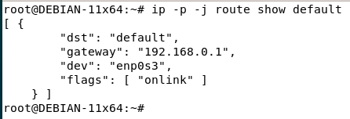
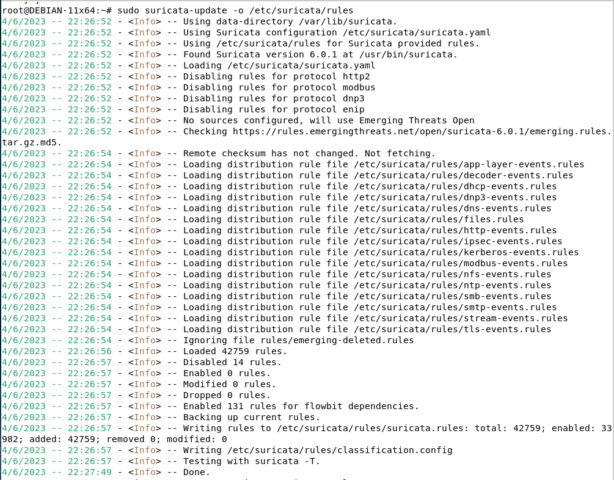
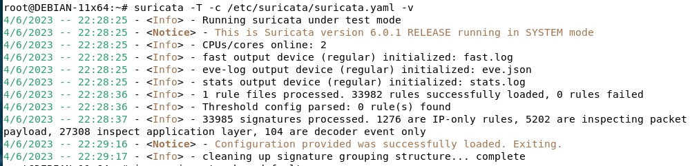

# Домашнее задание к занятию «Защита сети» Андрей Дёмин

### Подготовка к выполнению заданий

1. Подготовка защищаемой системы:

- установите **Suricata**,
- установите **Fail2Ban**.

2. Подготовка системы злоумышленника: установите **nmap** и **thc-hydra** либо скачайте и установите **Kali linux**.

Обе системы должны находится в одной подсети.

------

### Задание 1

Проведите разведку системы и определите, какие сетевые службы запущены на защищаемой системе:

**sudo nmap -sA < ip-адрес >**

**sudo nmap -sT < ip-адрес >**

**sudo nmap -sS < ip-адрес >**

**sudo nmap -sV < ip-адрес >**

По желанию можете поэкспериментировать с опциями: https://nmap.org/man/ru/man-briefoptions.html.


*В качестве ответа пришлите события, которые попали в логи Suricata и Fail2Ban, прокомментируйте результат.*

<ins>Ответ</ins>:

Для подготовки защищаемой системы произведена установка и настройка **Suricata**:

```
sudo apt install suricata jq
```
Чтобы проверить сетевой интерфейс, установленный по-умолчанию, выполнена команда:
```
ip -p -j route show default 
```


Произведены правки в конфигурационном файле:

```
sudo nano /etc/suricata/suricata.yaml
```
```
HOME_NET: "[192.168.0.0/24]"
...
af-packet:
  - interface: enp0s3
```
Путь к правилам, используемым по-умолчанию:
```
ls -1 /etc/suricata/rules/
```
Для их загрузки используем команду:
```
sudo suricata-update -o /etc/suricata/rules
```


Также можно добавить правила от сторонних поставщиков:
```
sudo suricata-update list-sources
sudo suricata-update enable-source tgreen/hunting -o /etc/suricata/rules
```

После загрузки правил необходимо проверить валидность конфигурации:
```
sudo suricata -T -c /etc/suricata/suricata.yaml -v
```


Рестарт сервиса:
```
sudo systemctl restart suricata
```
Запуск прослушивания сетевого интерфейса:
```
suricata -c /etc/suricata/suricata.yaml -i enp0s3
```
Просмотр лог-файла с обновлением по мере поступления данных:
```
tail -f /var/log/suricata/fast.log
```

### Задание 2

Проведите атаку на подбор пароля для службы SSH:

**hydra -L users.txt -P pass.txt < ip-адрес > ssh**

1. Настройка **hydra**: 
 
 - создайте два файла: **users.txt** и **pass.txt**;
 - в каждой строчке первого файла должны быть имена пользователей, второго — пароли. В нашем случае это могут быть случайные строки, но ради эксперимента можете добавить имя и пароль существующего пользователя.

Дополнительная информация по **hydra**: https://kali.tools/?p=1847.

2. Включение защиты SSH для Fail2Ban:

-  открыть файл /etc/fail2ban/jail.conf,
-  найти секцию **ssh**,
-  установить **enabled**  в **true**.

Дополнительная информация по **Fail2Ban**:https://putty.org.ru/articles/fail2ban-ssh.html.


*В качестве ответа пришлите события, которые попали в логи Suricata и Fail2Ban, прокомментируйте результат.*
