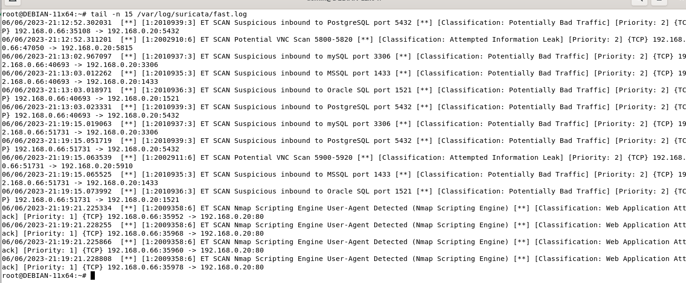
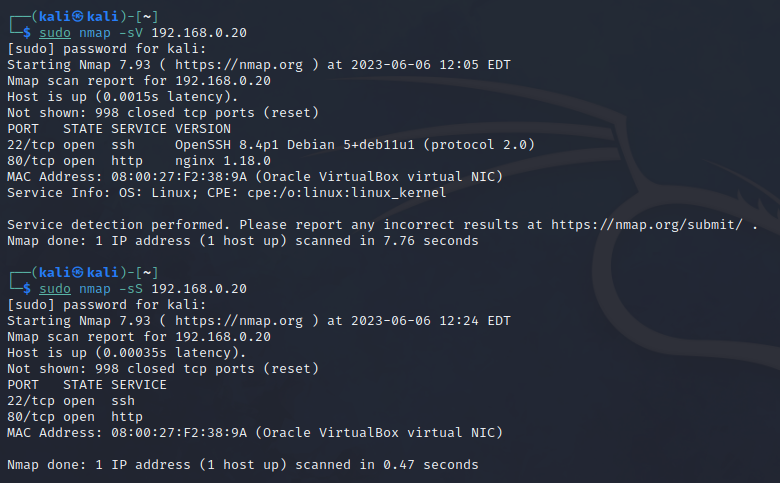
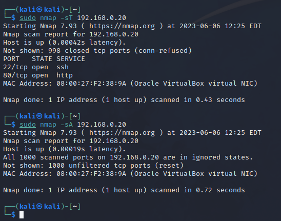
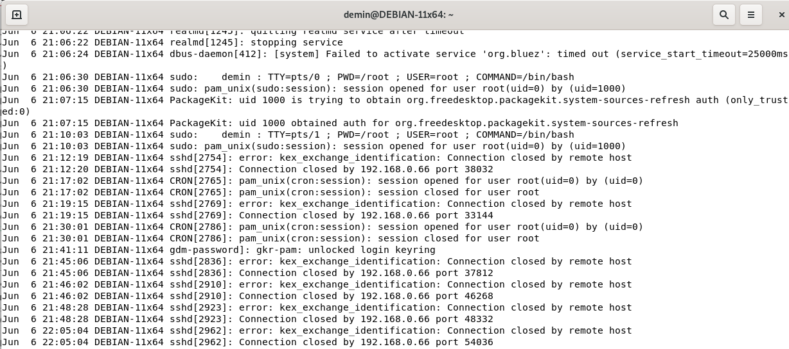
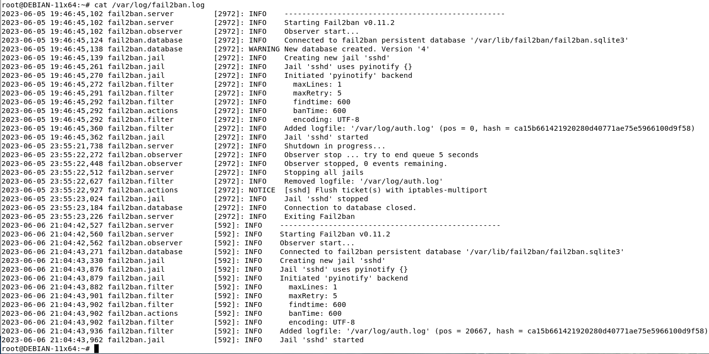
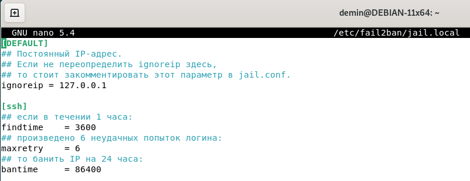
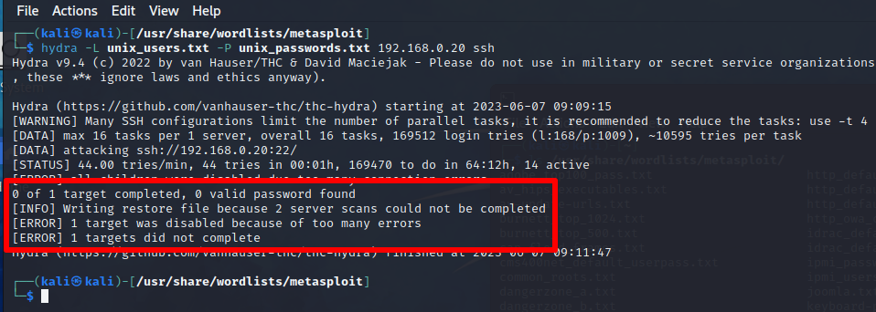

# Домашнее задание к занятию «Защита сети» Андрей Дёмин

### Подготовка к выполнению заданий

1. Подготовка защищаемой системы:

- установите **Suricata**,
- установите **Fail2Ban**.

2. Подготовка системы злоумышленника: установите **nmap** и **thc-hydra** либо скачайте и установите **Kali linux**.

Обе системы должны находится в одной подсети.

------

### Задание 1

Проведите разведку системы и определите, какие сетевые службы запущены на защищаемой системе:

**sudo nmap -sA < ip-адрес >**

**sudo nmap -sT < ip-адрес >**

**sudo nmap -sS < ip-адрес >**

**sudo nmap -sV < ip-адрес >**

По желанию можете поэкспериментировать с опциями: https://nmap.org/man/ru/man-briefoptions.html.


*В качестве ответа пришлите события, которые попали в логи Suricata и Fail2Ban, прокомментируйте результат.*

<ins>Ответ</ins>:

Для подготовки защищаемой системы произведена установка и настройка **Suricata**:

```
sudo apt install suricata jq
```
Чтобы проверить сетевой интерфейс, установленный по-умолчанию, выполнена команда:
```
ip -p -j route show default 
```


Произведены правки в конфигурационном файле:

```
sudo nano /etc/suricata/suricata.yaml
```
```
HOME_NET: "[192.168.0.0/24]"
...
af-packet:
  - interface: enp0s3
```
Путь к правилам, используемым по-умолчанию:
```
ls -1 /etc/suricata/rules/
```
Для их загрузки используем команду:
```
sudo suricata-update -o /etc/suricata/rules
```


Также можно добавить правила от сторонних поставщиков:
```
sudo suricata-update list-sources
sudo suricata-update enable-source tgreen/hunting -o /etc/suricata/rules
```

После загрузки правил необходимо проверить валидность конфигурации:
```
sudo suricata -T -c /etc/suricata/suricata.yaml -v
```


Рестарт сервиса:
```
sudo systemctl restart suricata
```
Запуск прослушивания сетевого интерфейса:
```
suricata -c /etc/suricata/suricata.yaml -i enp0s3
```
Просмотр лог-файла с обновлением по мере поступления данных:
```
tail -f /var/log/suricata/fast.log
```


Просмотр алертов по мере выполнения сканирования:





```
jq 'select(.alert)' /var/log/suricata/eve.json
```
```
{
  "timestamp": "2023-06-06T22:25:33.344112+0600",
  "flow_id": 1826545941168176,
  "in_iface": "enp0s3",
  "event_type": "alert",
  "src_ip": "192.168.0.66",
  "src_port": 34082,
  "dest_ip": "192.168.0.20",
  "dest_port": 5815,
  "proto": "TCP",
  "community_id": "1:h+hF8ztNrqL9z/VwH+GORxLx3dc=",
  "alert": {
    "action": "allowed",
    "gid": 1,
    "signature_id": 2002910,
    "rev": 6,
    "signature": "ET SCAN Potential VNC Scan 5800-5820",
    "category": "Attempted Information Leak",
    "severity": 2,
    "metadata": {
      "created_at": [
        "2010_07_30"
      ],
      "updated_at": [
        "2010_07_30"
      ]
    }
  },
  "flow": {
    "pkts_toserver": 1,
    "pkts_toclient": 0,
    "bytes_toserver": 74,
    "bytes_toclient": 0,
    "start": "2023-06-06T22:25:33.344112+0600"
  }
}
{
  "timestamp": "2023-06-06T22:25:33.354084+0600",
  "flow_id": 1510657539008292,
  "in_iface": "enp0s3",
  "event_type": "alert",
  "src_ip": "192.168.0.66",
  "src_port": 42686,
  "dest_ip": "192.168.0.20",
  "dest_port": 5432,
  "proto": "TCP",
  "community_id": "1:p3s6M2mYhPXabDJ67Ns9rrwZvJ4=",
  "alert": {
    "action": "allowed",
    "gid": 1,
    "signature_id": 2010939,
    "rev": 3,
    "signature": "ET SCAN Suspicious inbound to PostgreSQL port 5432",
    "category": "Potentially Bad Traffic",
    "severity": 2,
    "metadata": {
      "created_at": [
        "2010_07_30"
      ],
      "former_category": [
        "HUNTING"
      ],
      "updated_at": [
        "2018_03_27"
      ]
    }
  },
  "flow": {
    "pkts_toserver": 1,
    "pkts_toclient": 0,
    "bytes_toserver": 74,
    "bytes_toclient": 0,
    "start": "2023-06-06T22:25:33.354084+0600"
  }
}
{
  "timestamp": "2023-06-06T22:25:33.369014+0600",
  "flow_id": 1520840906482038,
  "in_iface": "enp0s3",
  "event_type": "alert",
  "src_ip": "192.168.0.66",
  "src_port": 42488,
  "dest_ip": "192.168.0.20",
  "dest_port": 1521,
  "proto": "TCP",
  "community_id": "1:8Njmc50iE+SeEx9bDZIhn8Jfnw0=",
  "alert": {
    "action": "allowed",
    "gid": 1,
    "signature_id": 2010936,
    "rev": 3,
    "signature": "ET SCAN Suspicious inbound to Oracle SQL port 1521",
    "category": "Potentially Bad Traffic",
    "severity": 2,
    "metadata": {
      "created_at": [
        "2010_07_30"
      ],
      "former_category": [
        "HUNTING"
      ],
      "updated_at": [
        "2018_03_27"
      ]
    }
  },
  "flow": {
    "pkts_toserver": 1,
    "pkts_toclient": 0,
    "bytes_toserver": 74,
    "bytes_toclient": 0,
    "start": "2023-06-06T22:25:33.369014+0600"
  }
}
{
  "timestamp": "2023-06-06T22:25:33.388655+0600",
  "flow_id": 1000071826894383,
  "in_iface": "enp0s3",
  "event_type": "alert",
  "src_ip": "192.168.0.66",
  "src_port": 58198,
  "dest_ip": "192.168.0.20",
  "dest_port": 1433,
  "proto": "TCP",
  "community_id": "1:D+CWDKg0h6iUU4r/3jxnpCVHQdM=",
  "alert": {
    "action": "allowed",
    "gid": 1,
    "signature_id": 2010935,
    "rev": 3,
    "signature": "ET SCAN Suspicious inbound to MSSQL port 1433",
    "category": "Potentially Bad Traffic",
    "severity": 2,
    "metadata": {
      "created_at": [
        "2010_07_30"
      ],
      "former_category": [
        "HUNTING"
      ],
      "updated_at": [
        "2018_03_27"
      ]
    }
  },
  "flow": {
    "pkts_toserver": 1,
    "pkts_toclient": 0,
    "bytes_toserver": 74,
    "bytes_toclient": 0,
    "start": "2023-06-06T22:25:33.388655+0600"
  }
}
```
Просмотр логов авторизации:
```
cat /var/log/auth.log
```


Просмотр лога **fail2ban**:

```
cat /var/log/auth.log
```


### Задание 2

Проведите атаку на подбор пароля для службы SSH:

**hydra -L users.txt -P pass.txt < ip-адрес > ssh**

1. Настройка **hydra**: 
 
 - создайте два файла: **users.txt** и **pass.txt**;
 - в каждой строчке первого файла должны быть имена пользователей, второго — пароли. В нашем случае это могут быть случайные строки, но ради эксперимента можете добавить имя и пароль существующего пользователя.

Дополнительная информация по **hydra**: https://kali.tools/?p=1847.

2. Включение защиты SSH для Fail2Ban:

-  открыть файл /etc/fail2ban/jail.conf,
-  найти секцию **ssh**,
-  установить **enabled**  в **true**.

Дополнительная информация по **Fail2Ban**:https://putty.org.ru/articles/fail2ban-ssh.html.


*В качестве ответа пришлите события, которые попали в логи Suricata и Fail2Ban, прокомментируйте результат.*

<ins>Ответ</ins>:

На защищаемой ВМ создан конфигурационный файл:
```
nano /etc/fail2ban/jail.local
```
```
[DEFAULT]
## Постоянный IP-адрес.
## Если не переопределить ignoreip здесь,
## то стоит закомментировать этот параметр в jail.conf.
ignoreip = 127.0.0.1

[ssh]
## если в течении 1 часа:
findtime    = 3600
## произведено 6 неудачных попыток логина:
maxretry    = 6
## то банить IP на 24 часа:
bantime     = 86400
```


На атакующей ВМ (Kali Linux) осуществлен переход в каталог, содержащий файлы с логинами и паролями:
```
cd /usr/share/wordlists/metasploit/
```


Запущен брутфорс:
```
hydra -L unix_users.txt -P unix_passwords.txt 192.168.0.20 ssh
```



